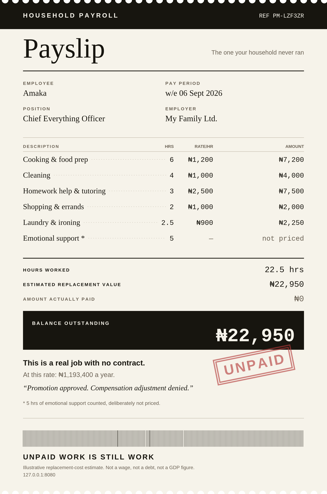

# PAY ME

### *The household payroll nobody runs*

**You've been working for free. Let's calculate the bill.**

PAY ME turns a week of unpaid housework into a formal payslip — hours, rates,
totals, and a balance outstanding that nobody is ever going to settle.

It is a joke you can screenshot, sitting on top of economics that holds up:
under standard national-accounting conventions, unpaid household services such
as cooking, cleaning and childcare fall **outside the GDP production boundary**.
The work happens. The measurement doesn't count it. PAY ME counts it.

**[▶ Live demo](https://bokjong393.github.io/Mybusiness/)**

> **Also in this repo, for the same challenge:**
> - **[SAPA](sapa/)** — Nigeria's Personal Financial Survival Simulator. A financial
>   runway calculator, a 30-day survival game, and a stress-test lab.
> - **[Village People — Meeting Minutes](village-people/)** — describe your bad week,
>   receive the official minutes of the meeting where your village people planned it.



---

## What it does

1. **Tap what you did this week** — cooking, cleaning, tutoring your siblings,
   queuing at the bank for your mum, and seven more.
2. **Or just describe your week in your own words** and let AI turn the mess
   into a timesheet you can correct before anything is calculated.
3. **Set the hours**, roughly. Nobody keeps a stopwatch on this work.
4. **Run payroll.** You get a payslip you can download and send to the group chat.

Then it shows you that this isn't only your household: Nigeria's Time Use
Survey 2024 reported women spending about five hours a day on unpaid domestic
and care work, against about one hour for men.

## The part that matters: AI never touches the money

This is the core design decision, and it is deliberate.

```
  You describe your week
          │
          ▼
  ┌─────────────────┐   categories + hours only
  │   AI (optional) │ ──────────────────────────┐
  └─────────────────┘                           │
                                                ▼
  Tap the chips instead ───────────────►  ┌──────────────┐
                                          │    engine    │  ← all arithmetic
                                          │  (pure JS)   │     lives here
                                          └──────┬───────┘
                                                 ▼
                                            Your payslip
```

A language model is asked to do exactly two things: **read messy text into
categories and hours**, and **write one job title and one HR one-liner**. It is
never asked for a rate, a multiplication, or a total. Every naira figure is
computed in [`assets/js/engine.js`](assets/js/engine.js), which is pure,
deterministic, and covered by [unit tests](tests/engine.test.mjs).

If an LLM hallucinated the economics, the joke would stop being funny and start
being embarrassing. So it doesn't get the chance.

**The consequence: AI failure never breaks the product.** With no API key, no
network, or a dead provider, the tap-chips work, a built-in keyword classifier
still reads your free text, and the payslip still generates. There is no state
in which this app shows a spinner forever.

## The economics

PAY ME uses the **replacement-cost** method: roughly what it would cost to buy
each service on the market.

$$V = \sum_i (\text{hours}_i \times \text{replacement rate}_i)$$

Replacement cost is used instead of **opportunity cost** on purpose. Opportunity
cost values work by what the person could have earned elsewhere, so a doctor and
a student washing the same plates produce wildly different numbers. That is
interesting in a seminar and useless in a product about invisible labour.

The choice is not cosmetic: across OECD countries analysed, replacement-cost
valuation of unpaid work averaged about **15% of GDP**, while opportunity-cost
valuation averaged about **27%**.

### About the rates

The default hourly rates are **illustrative estimates of Nigerian service
prices, not survey data**, and the app says so. Rather than fake precision,
PAY ME gives you three honest positions on the same method — Conservative,
Typical, Higher-cost — and lets you **edit every individual rate**. Disagree
with my assumptions and the payslip recalculates.

**Emotional support is counted in hours and never priced.** There is no honest
market substitute for it, and pretending otherwise would undermine the
categories that do have real comparators.

### What this is not

Not a wage. Not a debt. Not a legal claim. Not a measure of GDP. It is an
illustrative estimate of what comparable services might cost to replace, wrapped
in a joke about payroll.

## Running it locally

No build step, no dependencies, no bundler.

```bash
git clone https://github.com/bokjong393/Mybusiness.git
cd Mybusiness
npm start          # serves on http://localhost:8080
npm test           # runs the engine unit tests
```

Or just open `index.html` in a browser.

## Single-file build

The whole app can be collapsed into one self-contained HTML file with no
external requests at all — useful for an offline copy, a sandboxed host, or
handing someone a file that just opens.

```bash
npm run build:standalone   # -> dist/pay-me-standalone.html
```

It is generated from the same sources by [`tools/build-standalone.mjs`](tools/build-standalone.mjs),
so it cannot drift from the real app, and the build verifies every inlined file
survived byte-for-byte before writing.

Standalone builds run in **embedded mode**: a sandboxed frame can't start a
download, so the payslip is presented as an ordinary image you can long-press to
save, and the app upgrades to a real download button if the host offers one.

## Using your own AI key

Entirely optional — the app is fully functional without one.

- **In the browser (default).** Open *Use your own AI key*, pick Claude or
  Gemini, paste your key. It is stored only in your browser's `localStorage`
  and sent only to that provider. It never reaches this site, because this site
  has no server.
- **Server-side (recommended if you fork and host it).** Deploy
  [`api/interpret.js`](api/interpret.js) on Vercel/Netlify/Cloudflare, set
  `ANTHROPIC_API_KEY` or `GEMINI_API_KEY` as an environment variable there, then
  set `window.PAY_ME_CONFIG.proxyUrl = 'api/interpret'` in `index.html`.
  Visitors then need no key at all and the key never touches client code.

No API key is committed to this repository, and `.gitignore` blocks `.env` files
from ever being added.

## Tech

| | |
|---|---|
| Frontend | Vanilla HTML/CSS/JS — no framework, no build, no dependencies |
| Payslip | Rendered natively to `<canvas>` at 2× |
| AI | Claude (`claude-opus-5`) or Gemini, both optional, both bring-your-own-key |
| Maths | Pure JS, 14 unit tests via `node --test` |
| Hosting | GitHub Pages, deployed by GitHub Actions |

The payslip is drawn straight to canvas rather than rasterised from the DOM with
a library like `html-to-image`. The exported image *is* the product, so it can't
depend on a CDN script that might fail on a slow connection mid-demo. Native
canvas means what you see is byte-identical to what downloads.

## Accessibility

Keyboard-operable throughout, `aria-pressed` on all toggles, live regions for
status messages, a skip link, visible focus rings, light and dark themes, and a
full text summary table beneath the canvas so the payslip's contents are
available to screen readers.

## Credits

Built by **Peace Sossa** for the **MIVA May Cohort 25 AI Build Challenge**.

Context data referenced in the app: National Bureau of Statistics (Nigeria)
*Time Use Survey 2024*; the System of National Accounts production boundary;
OECD analysis of unpaid-work valuation methods.

## License

[MIT](LICENSE)

---

*Invisible doesn't mean worthless.*
